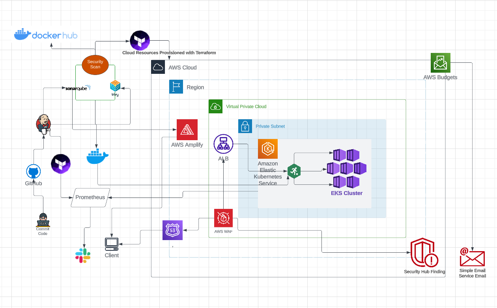

# DEPLOYING LAKESIDE MUTUAL, A MICRO-SERVICES APP ON AWS USING TERRAFORM, KUBERNETES AND JENKINS

This project adopts a CI/CD approach to deploy a microservices-based architecture on AWS, using Kubernetes, Terraform and Jenkins to execute Infrastructure as Code...
